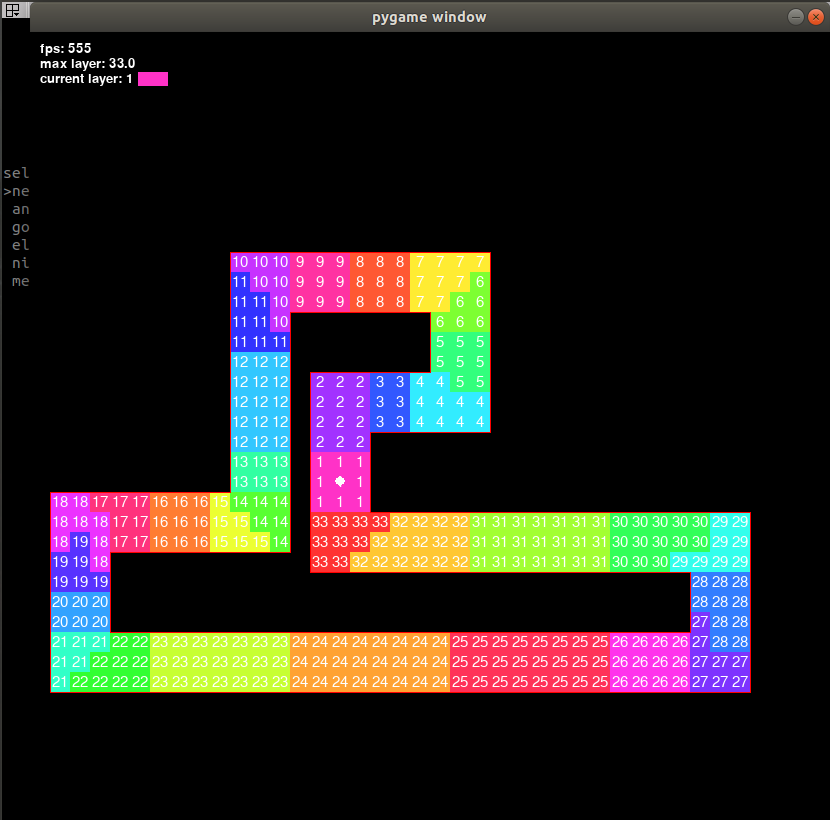

# pgGEneticAlgo
a genetic algoritm learning to navigate a "race track".
The working model can be found in multi.
A map editor is provided under map creator.
Here is a screenshot of the creators trying to solve the track at th efirst gen.

Here is a screenshot of the map editor.

might require sudo to run because of keyboard library for menu.
ray must be installed with pip not pip3
